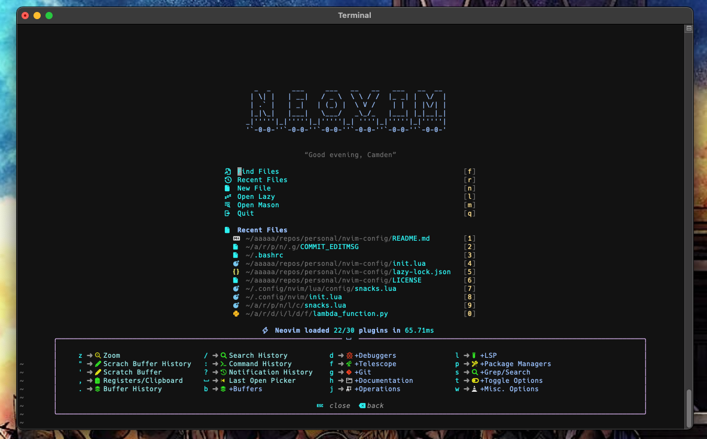

# LazyNVIM

## Table of Contents:
- [Overview](#overview)
- [Directory Structure](#directory-structure)
- [Features](#features)
- [Getting Started](#getting-started)
- [Demos](#demos)
- [Tips](#tips)
- [Plugin References](#plugin-references)

&nbsp;

## Overview
This repository stores a custom tailored NVIM environment used for development built by [@lupes14](https://github.com/lupes14).


&nbsp;

## Directory Structure
```
├── README.md
├── init.lua
├── lazy-lock.json
└── lua
    ├── config
    │   ├── ${PLUGIN CONFIGS}
    │   ├── vim
    │   │   ├── keymaps.lua
    │   │   └── settings.lua
    └── plugins
        ├── ${PLUGIN DECLARATIONS}
```

&nbsp;

## Features
- Custom themes
    - Additionally, installs a 3rd party theme based off the nigh-owl VSCode theme
- Configures the Lazy package manager to automatically install and manage plugins
- Configures the Mason package manager to handle installation and configuration of LSP servers
- Configures the `folke.snacks` plugin, which provides:
    - NVIM custom dashboard
    - Custom VIM keymaps
    - Custom pickers to enable fuzzy finders, grep, and a file explorer
    - Custom notifications
    - Custom indentation with dynamic indent highlighting
- Configures LSP server integrations
- Configures LSP specific parsing and syntax highlighting
- Configures a completion engine (CMP)
- Configures a floating terminal toggle similarly to VSCode's integrated terminal
- Configures nvim-dap for debugging
    - Currently only python debugging is configured.
    - The python debugger has dependencies required to be installed.
    - See [Feature Dependencies](#dependencies).
- Configures lualine to replace the default NVIM staus-line
- Configures the statuscolumn to show modifications of git files
- Configures custom command line and notification window UIs
- Configures commenting out lines/blocks of code
- Configures NVIM to have the cursor remember the last place you were in a file
- Configures NVIM to have a floating pop up window to show your key maps
- Configures NVIM helper functions for plugins to leverage
- Configures NVIM game to practice VIM movement and command motion combinations

&nbsp;

## Getting Started

### Dependencies
1) The `snacks.nvim` plugin requires a nerd font to be installed since the default icon configuration is nerdfont icons. You can switch to unicode icons if preffered.

To set up nerdfont on a Mac:
- Tap the nerdfont brew repo cask:
```
brew tap homebrew/cask-fonts
```
- Install a nerd font
```
font-hack-nerd-font
```

2) The `nvim-dap` plugin requires `debugpy` to be installed. You can install this globally, but that may mess with pip packages since we have to install with pip.

It is recommended to install `debugpy` into a virtual environment set at your user's path, and reference this venv in your `nvim-dap` config. This way the `debugpy` package is not installed globally but can still be used by NVIM.

If you are on a Mac and you may already have a `.venv` at your user's path depending how you install python, so you may have to skip the first command below:
```
python3 -m venv ~/.venv/debugpy
source ~/.venv/debugpy/bin/activate
pip3 install debugpy
```

Then inside the `config/nvim-dap.lua` you need to specifiy the path to the venv storing debugpy.

### Installation

1) Make a `.config` directory with a `nvim` directory inside it

```
cd ~
mkdir .config/nvim
```

2) Clone the GitHub repository

```
git clone git@github.com:lupes14/nvim-setup.git
```

3) Navigate into the repo, and copy contents into the `.config/nvim` directory. Do not copy over the `.git` directory or other GitHub related files. The command below should handle that for you.

```
cd ${REPO BASE PATH}
find . \( -name ".git" -o -name "images" \) -prune -o -print | cpio -pdm ~/.config/nvim
```

4) Open VIM and Lazy should automatically install. Lazy is the package manager being used to install plugins. Lazy will automatically install the plugins as long as there are no breaking config changes.

&nbsp;

## Demos

For a full list of all the snacks plugin feature demos, check out Folke's repository in the plugin references!

### Lazy Package Manager


### Mason Package Manager


### Floaterm


### NVIM DAP


### Which-Key


&nbsp;

## Tips

- To configure lazy loading settings, update plugin declarations in `lua/plugins/${PLUGIN DECLARATION}`.
    - An example of lazy loading can be found here [plenary.lua](./lua/plugins/plenary.lua)
- [keymaps.lua](./lua/config/vim/keymaps.lua) utilizes snacks keymaps, your own custom keymaps, and which-key configurations for keymap descriptions etc.
- [settings.lua](./lua/config/vim/settings.lua) configures VIM settings such as highlight groups and other options typically set by vimscript.
- The snacks dashboard will take the date/time and a user alias defined in your shell rc (`.bashrc`/`.zshrc`) or default to the machine's user name

&nbsp;

## Plugin References
- Night-owl: [nigh-owl.vim](https://github.com/haishanh/night-owl.vim)
- Lazy: [lazy.nvim](https://github.com/folke/lazy.nvim)
- Mason: [mason.nvim](https://github.com/williamboman/mason.nvim)
- Snacks: [snacks.nvim](https://github.com/folke/snacks.nvim)
- nvim-lspconfig: [nvim-lspconfig](https://github.com/neovim/nvim-lspconfig)
- Treesitter: [nvim-treesitter](https://github.com/nvim-treesitter/nvim-treesitter)
- CMP: [nvim-cmp](https://github.com/hrsh7th/nvim-cmp)
- Floaterm: [vim-floaterm](https://github.com/voldikss/vim-floaterm)
- NVIM DAP: [nvim-dap](https://github.com/mfussenegger/nvim-dap)
- Lualine: [lualine.nvim](https://github.com/nvim-lualine/lualine.nvim)
- Gitsigns: [gitsigns.nvim](https://github.com/lewis6991/gitsigns.nvim)
- Noice: [nvim.noice](https://github.com/folke/noice.nvim)
- Tcomment: [tcomment_vim](https://github.com/tomtom/tcomment_vim)
- vim-lastplace: [vim-lastplace](https://github.com/farmergreg/vim-lastplace)
- Which-key: [which-key.nvim](https://github.com/folke/which-key.nvim)
- Plenary: [plenary.nvim](https://github.com/nvim-lua/plenary.nvim)
- Vim-be-good: [vim-be-good](https://github.com/ThePrimeagen/vim-be-good)

